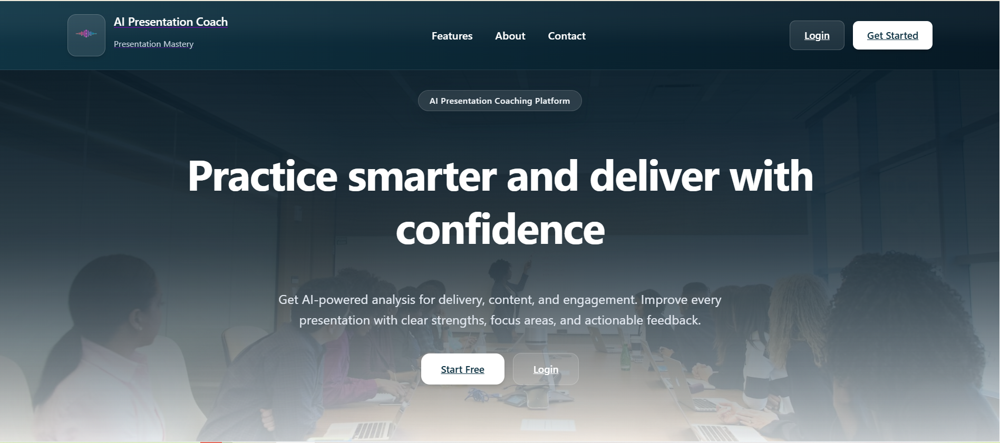
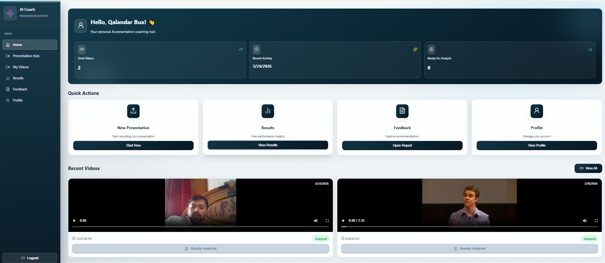
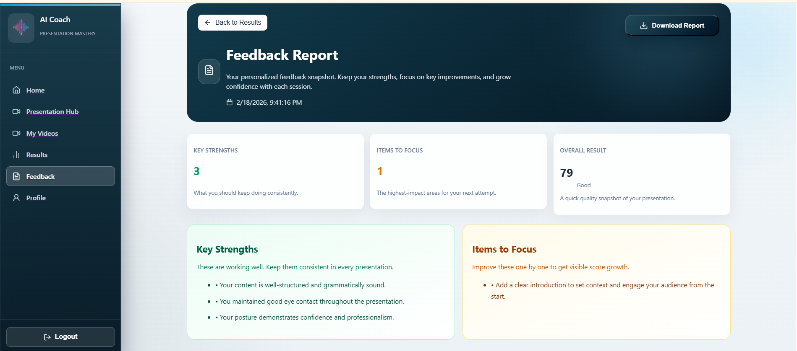
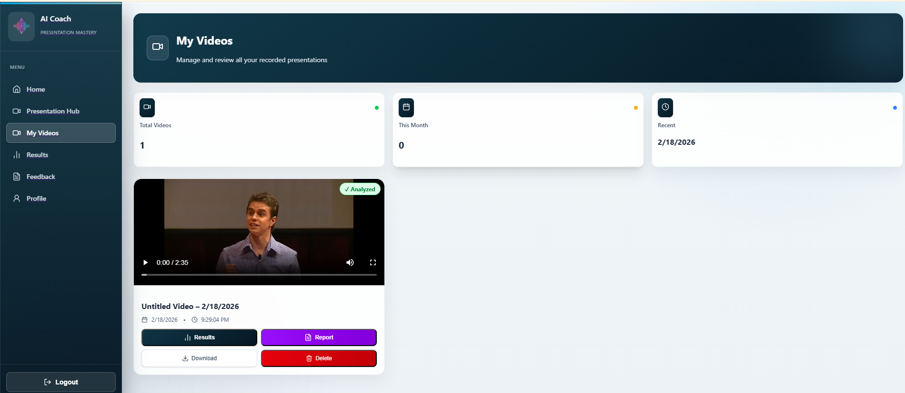
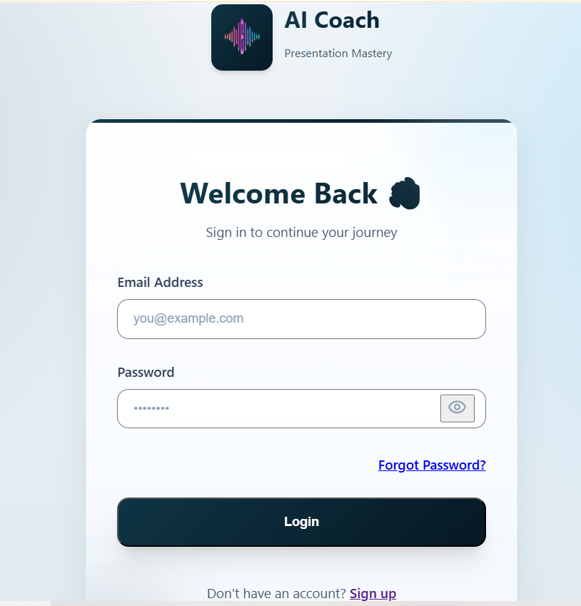

<div align="center">
  
  
  
  

  <h1>🎙️ AI Presentation Coach</h1>
  <p>Practice smarter and deliver with confidence using AI-powered analysis.</p>
</div>

---

## 📖 Overview

The **AI Presentation Coach** is a modern, web-based platform designed to help users refine and master their presentation skills. By leveraging advanced video processing and an intuitive interface, the application analyzes your delivery, providing actionable feedback on your performance.

Whether you're preparing for a boardroom pitch, a conference, or a student presentation, AI Presentation Coach gives you real-time insights to improve your public speaking.



## ✨ Key Features

- **User Accounts & Profiles**: Secure signup, login, and personalized progress tracking across sessions.
- **Video Management**: Seamlessly upload and manage your past presentations directly from the interactive dashboard.
- **Presentation Hub**: Start live recordings or upload prior videos to be queued for analysis.
- **Feedback & Metrics**: After processing, receive a detailed "Feedback Report" breaking down:
  - Overall Score (Quality Snapshot)
  - Key Strengths to keep consistent
  - Items to Focus on for future improvement
- **Desktop Ready**: Configured for simple packaging into a standalone, executable desktop application via PyInstaller and Electron. 

---

## 🎨 Interface Preview

### 🏠 Dashboard
Your personal command center. Track total videos created, recently analyzed content, and dive directly into quick actions like starting a new session or reviewing past feedback.


### 📊 Feedback Report
The core of the platform. Receive granular, data-driven feedback detailing exactly what went well and what needs adjustment.


### 🎥 My Videos
Easily watch, report on, or delete previously recorded presentation sessions. 


### 🔒 Login & Authentication
A beautiful, responsive authentication flow securing your presentation data.


---

## 🛠️ Technology Stack

**Frontend (Client)**
* **Next.js & React**: For lightning-fast rendering and interactive components.
* **Tailwind CSS / Custom Styling**: For a modern, responsive, and sleek "dark-mode" leaning interface.

**Backend (Server)**
* **Flask (Python)**: Robust API routing handling authentication, session states, and video proxying.
* **MongoDB Atlas**: Secure cloud database storing user information, encrypted passwords, and video metadata.
* **Whisper & FFMPEG**: *Pre-configured* for cutting-edge audio extraction and transcription tracking.

**App Packaging**
* **Electron & PyInstaller**: Ready-to-build scripts (`build_backend.cmd`, `build-desktop.ps1`) to compile the client and server into a standalone cross-platform app!

---

## 🚀 Installation & Setup

1. **Clone the repository**
   ```bash
   git clone https://github.com/Qalandar-Bux1/AI-Presentation-coach.git
   cd AI-Presentation-coach
   ```

2. **Backend Setup (Flask)**
   Ensure you have Python installed and run the following commands:
   ```bash
   cd server
   python -m venv venv
   # Activate Environment:
   # Windows: venv\Scripts\activate
   # Mac/Linux: source venv/bin/activate
   
   pip install -r requirements.txt
   ```
   *Note: Ensure you have populated the `.env` file in the server directory with your MongoDB Atlas URI (`MONGO_URI`) and Flask configurations.*
   ```bash
   python app.py
   ```

3. **Frontend Setup (Next.js)**
   Open a new terminal session.
   ```bash
   cd client
   npm install
   npm run dev
   ```
   Your application will now be running simultaneously at `http://localhost:3000`.

---

## 🔮 Future Roadmap

- [ ] Complete integration of the Mediapipe framework for live posture and eye-contact tracking.
- [ ] Add real-time "filler-word" counters ("um", "uh", "you know").
- [ ] Advanced dynamic charts visualizing progress across multiple time horizons.
- [ ] Direct cloud storage integrations for video (AWS S3 / Firebase).

---

> **Note on Adding Images**: To get the preview images showing up locally or on GitHub, place the 5 provided screenshot files into a new `docs/` folder in the root of the project with the names: `landing.png`, `dashboard.png`, `feedback.png`, `my-videos.png`, and `login.png`.
